# Getting Started with ESP32

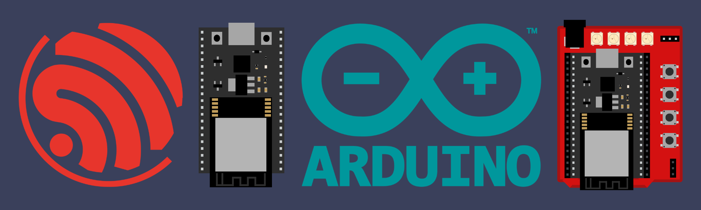

## Contents

- [Getting Started](#getting-started)
- [Expansion Board](#expansion-board)
- [Communication Methods](#communication-methods)
- [Cloud Services](#cloud-services)

## Getting Started

[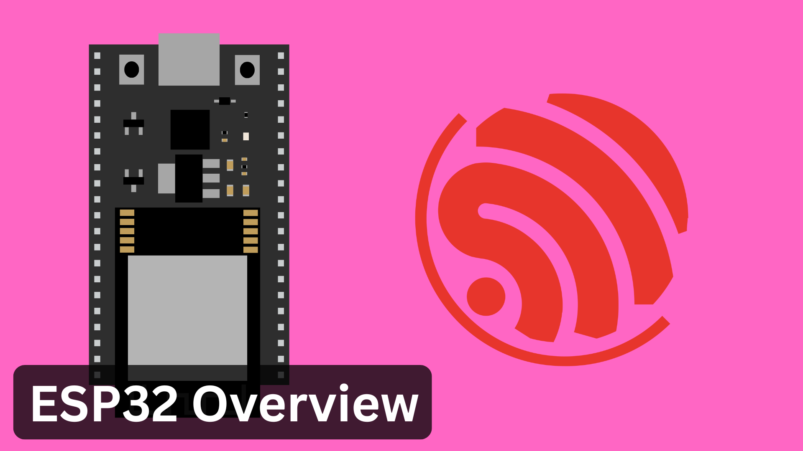](/contents/Getting-Started/Overview/)
[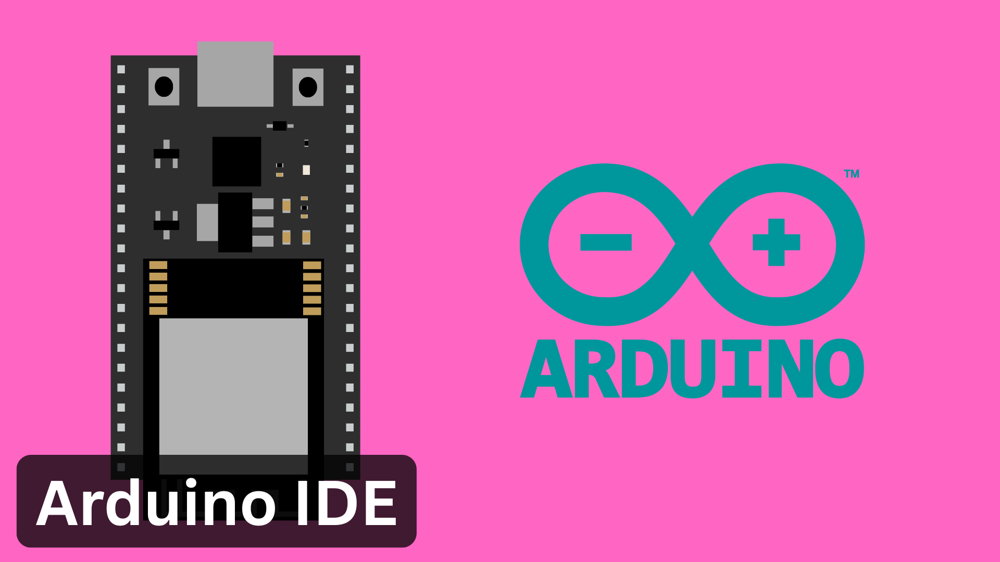](/contents/Getting-Started/Arduino-IDE/)

## Expansion Board

[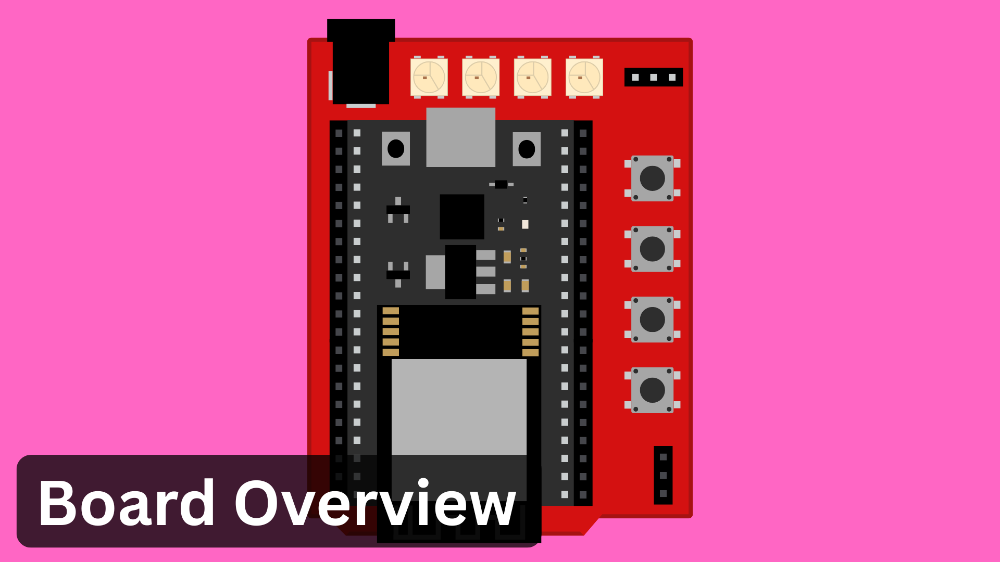](contents/Expansion-Board/Overview/)
[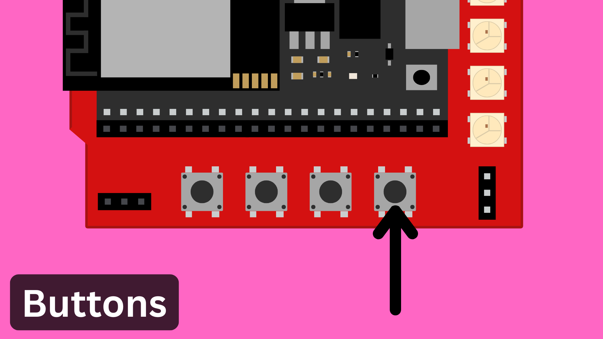](contents/Expansion-Board/Buttons/)
[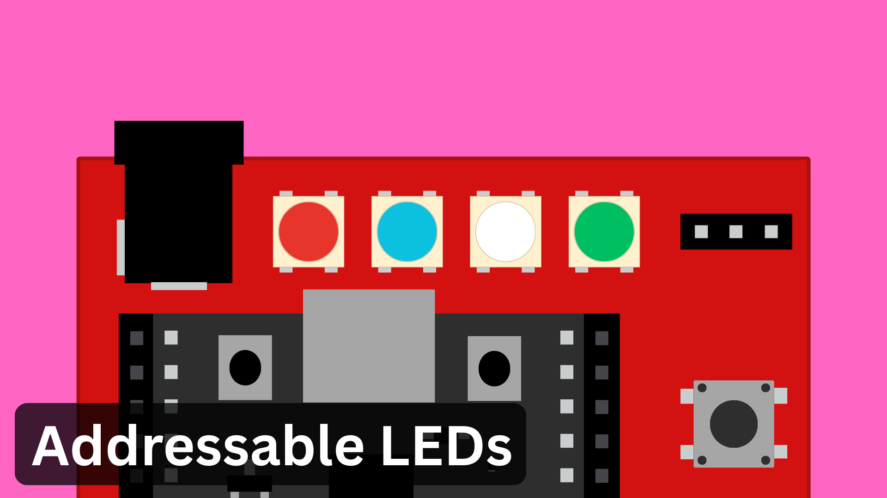](/contents/Expansion-Board/LEDs/)
[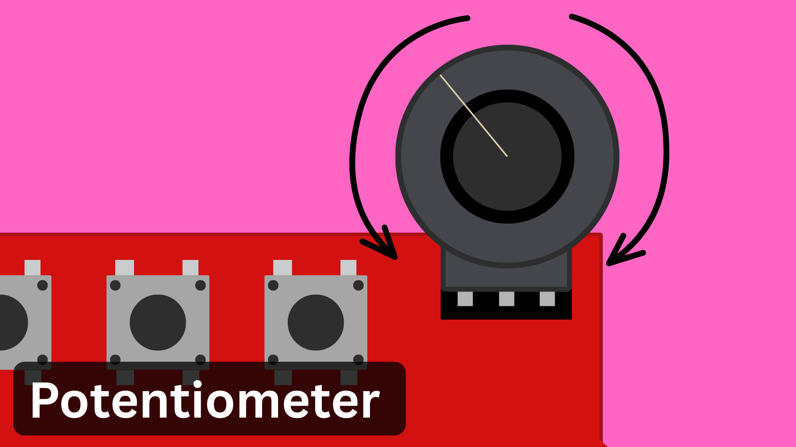](/contents/Expansion-Board/Potentiometer/)
[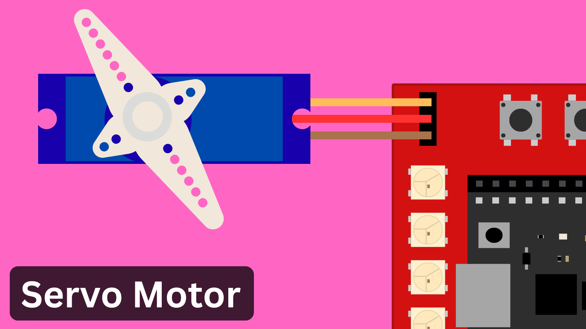](/contents/Expansion-Board/Servo/)

## Communication Methods

[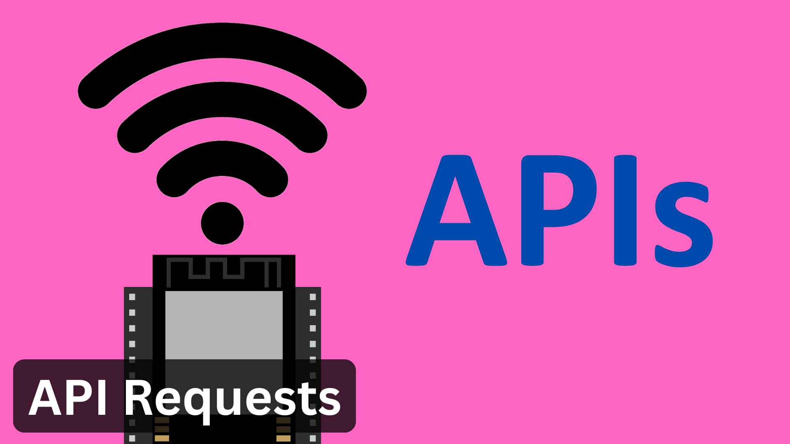](/contents/Communication/APIs/)
[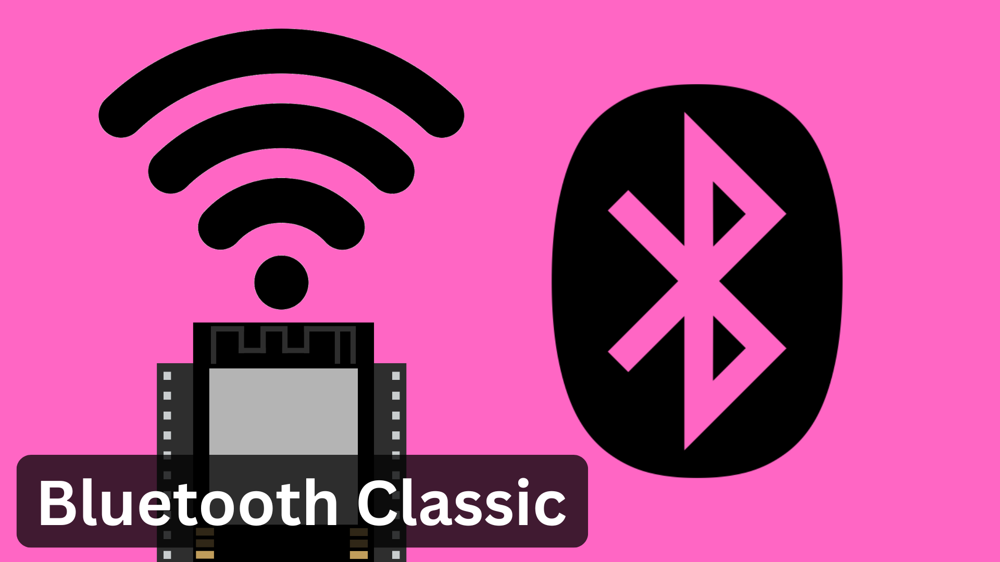](/contents/Communication/Bluetooth-Classic/)
[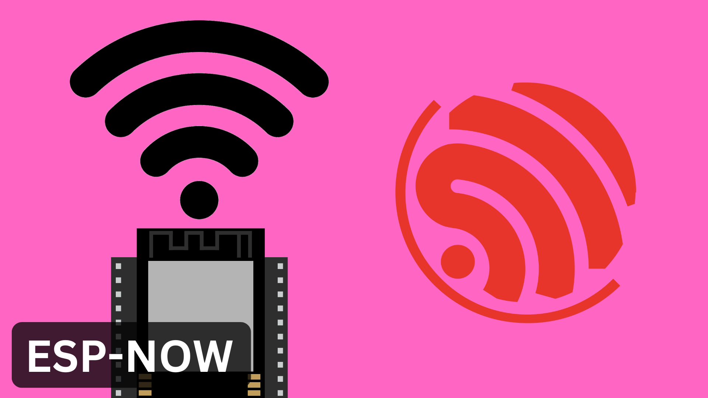](/contents/Communication/ESP-NOW/)
[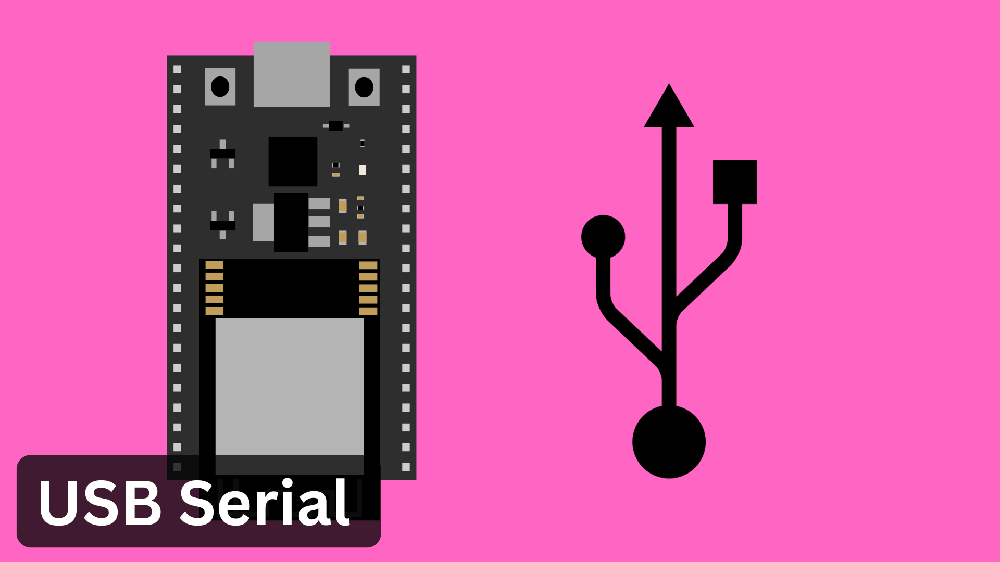](/contents/Communication/USB-Serial/)
[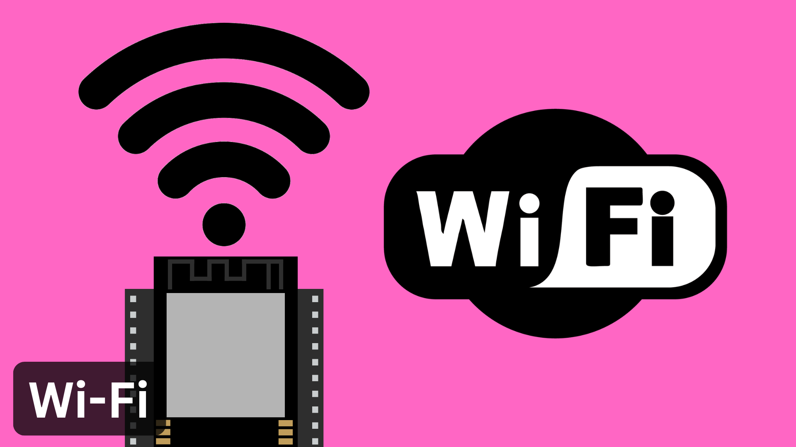](/contents/Communication/Wi-Fi/)

<!-- [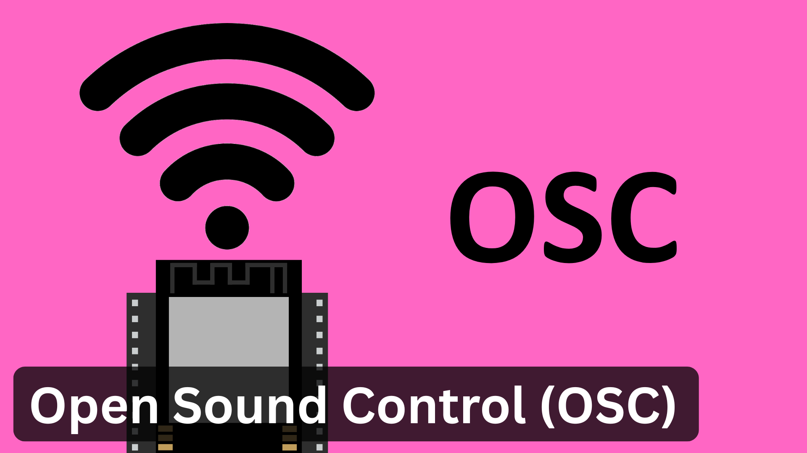](/contents/Communication/OSC/) -->

## Cloud Services

[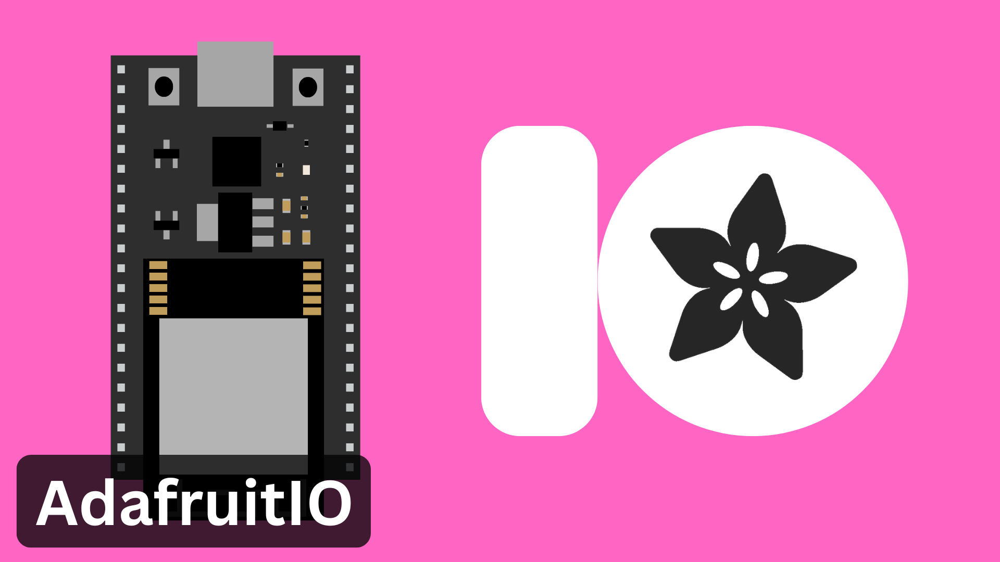](/contents/Cloud-Services/AdafruitIO/)
<!-- [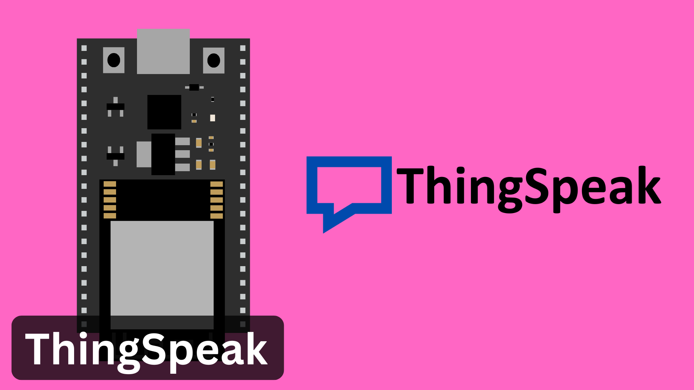](/contents/Cloud-Services/ThingSpeak/) -->