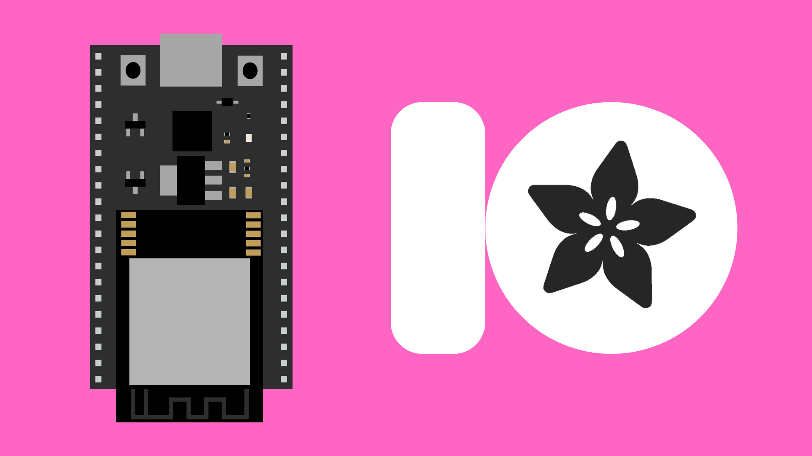
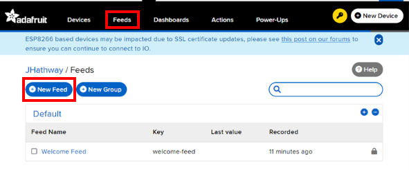
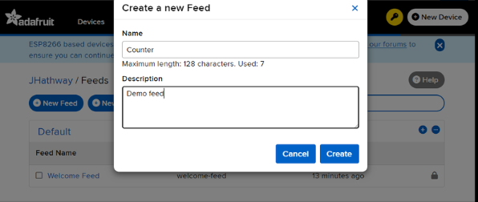
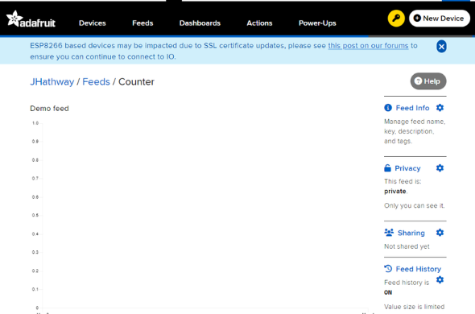
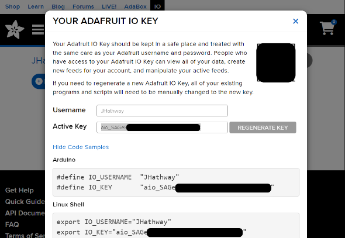

# AdafruitIO with ESP32




## Contents

- [Introduction](#introduction)
- [AdafruitIO](#adafruitio)
    - [Setting up an Account](#setting-up-an-account)
    - [Creating a Feed](#creating-a-feed)
    - [Keys](#keys)
- [Code](#code)
    - [Publish](#publish)
    - [Subscribe](#subscribe)


## Introduction

[AdafruitIO](https://io.adafruit.com/) is a cloud service created by Adafruit for use in IoT projects. It allows you to set up online feeds where you can store (publish) and retrieve (subscribe) data to/from your ESP32. You can send up to 30 data points per minute using the free version of AdafruitIO.

As well as hosting  data, AdafruitIO has options for creating custom UIs to visualize your data. You can also set up actions to notify you directly about your feeds.


## AdafruitIO


### Setting up an Account

To get started, you will need to create an account at [io.adafruit.com](https://io.adafruit.com/). You will need to create a username and password. Make sure these are something unique and memorable as you will need to use them in your code.


### Creating a Feed

In order to send and receive information, you will need to create a feed to host the data. First navigate to the "Feeds" tab, and from there, select "New Feed".



You can then give the feed a name and short description.



Once created, you can open the feed and you will see a graph and data feed where you will be sending data to from your ESP32. This will be empty now as you haven't sent it any data yet.



### Keys

To access your feed from your ESP32, you will need to provide Adafruit IO with a key for your feed. This is a common security precaution for APIs that mean only devices with an authorised key can access your feed.

To find your feed's key, open your feed and click the key symbol.


This should then display your username and active key.



Make a note of these details as you will need to use them in your sketch.


## Code

Example Sketches:
- [Publish](./AdafruitIO_Publish_Basic/AdafruitIO_Publish_Random.ino)
- [Subscribe](./AdafruitIO_Subscribe_Basic/AdafruitIO_Subscribe_Basic.ino)

You will need to install the [AdafruitIO library](https://github.com/adafruit/Adafruit_IO_Arduino) from the IDE's Libraries Manager. The AIO library then provides us with some objects that need setup in the global variable space, before the `setup()`function. 

Make sure your details/names are spelled correctly, including spaces and capital letters.

``` cpp
#include <AdafruitIO_WiFi.h>

// Replace these parameters with your:
// - AdafruitIO username
// - AdafruitIO feed key
// - Wi-Fi network name
// - Wi-Fi password
AdafruitIO_WiFi io("aio_username", "aio_key", "wifi_name", "wifi_password");

// Replace "feed_name" with your actual feed name e.g. "Counter"
AdafruitIO_Feed *myFeed = io.feed("feed_name");
``` 

Inside the `setup()` function, we can connect to our AdafruitIO account using the `connect()` method.

``` cpp
void setup() {
    io.connect();
    while (io.status() < AIO_CONNECTED) {} // wait until connected
}
```


### Publish

"Publishing" is the word AdafruitIO uses to refer to sending data from your ESP32 to your feed.

To publish to one of your feeds, we can use the `save()` method in the `AdafruitIO_Feed` object.

``` cpp
// Publish value 123 to my feed
myFeed->save(123);
```

It is important to note that you can send a maximum of 30 messages per minute to your feed using the free version of AdafruitIO. You may need to add a `delay()` to your code to make sure you do not exceed this.


### Subscribe

"Subscribing" is the word AdafruitIO uses to refer to receiving data from your feed to your ESP32.

To subscribe from a feed, you will then need to create a callback function. This function will be called every time a message is received from AIO.

For this example, we will just print the incoming data to the Serial Monitor - although yours can so anything you like. You will then need to pin it to the `AdafruitIO_Feed` object in  the `setup()` function.

``` cpp
void handleMessage(AdafruitIO_Data *data) {
    // Receive incoming data
    String incomingData = data->value();
    
    // print incoming data to Serial Monitor
    Serial.print("received <- ");
    Serial.println(incomingData);
}

void setup() {
    Serial.begin(115200);

    // Connect to AIO
    io.connect();
    while (io.status() < AIO_CONNECTED) { } // wait until connected

    Serial.println(io.statusText());

    // Pin callback function to message received
    myFeed->onMessage(handleMessage);
    myFeed->get();
}
```

You will then need to add `io.run();` at the top of your `loop()` function to make sure the ESP32 stays connected and receives any new messages.

``` cpp
void loop() {
  io.run();
}
```