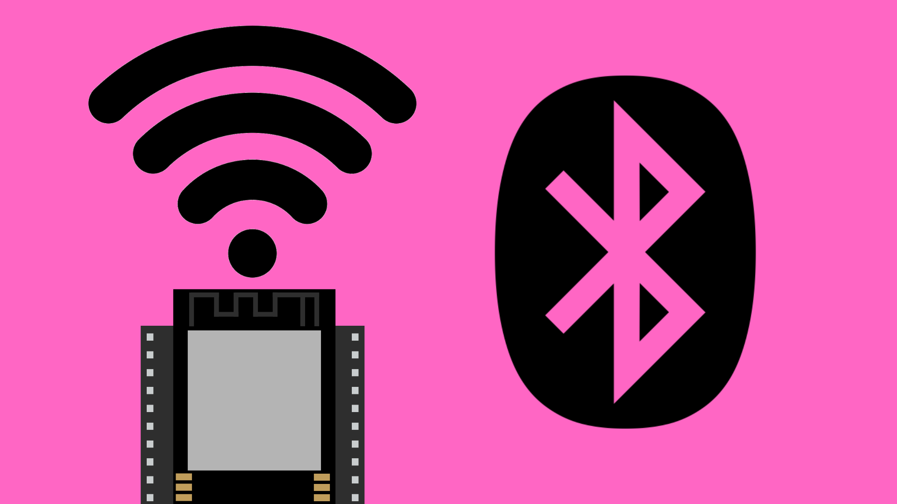
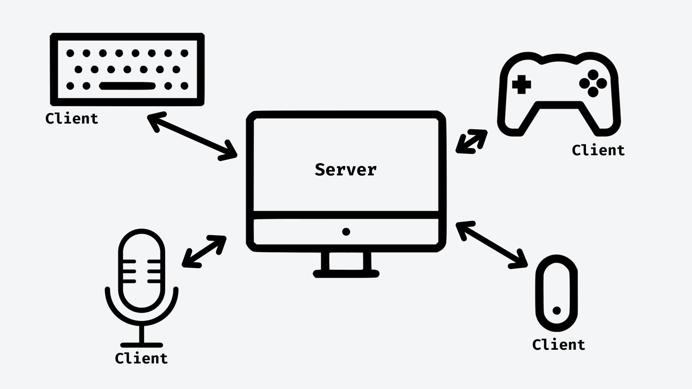

# Bluetooth Classic with ESP32



## Contents
- [Introduction](#introduction)
    - [Server vs Client Devices](#server-vs-client-devices)
    - [Server or Client?](#should-my-device-be-Server-or-client)
- [Code](#code)
    - [Library](#bluetoothserialh-library)
    - [Setup](#setup)
    - [Send Bluetooth messages](#send-bluetooth-messages)
    - [Receive Bluetooth messages](#receive-bluetooth-messages)

## Introduction

The ESP32 provides us with the option of using Bluetooth as another means of wireless communication in our projects. With the `BluetoothSerial.h` library, we can easily send and receive data over Bluetooth using your ESP32. This makes it ideal for projects where wireless communication between the ESP32 and other Bluetooth-enabled devices is required, such as sending sensor data or controlling devices remotely.


### Server vs Client Devices

Bluetooth communication between devices requires us to set one device as the "server", and connected devices as "clients". This structure allows the server to communicate with up to seven client devices, but means each client can only connect to one server at a time.

You can think of this like connecting multiple devices like mouse, keyboard and headphones to one device like a laptop or computer. In this example, it makes sense for the server to be able to connect to multiple clients without them connecting to other computers. 



You might also notice in this example that client devices can both send data (like the mouse and keyboard) and receive data (like the headphones). The server/client model does not mean that the communication is only one-way; it is simply a way of organizing and managing a network of devices.


### Should my device be Server or Client?

Generally, when you are using your ESP32 to receive Bluetooth data from another device (e.g. a phone or computer) you should set your ESP32 to act as a client. 

Otherwise, if you are connecting multiple ESP32 or similar devices, you will need to decide which one is the server and which is/are the client device(s). If your project requires one ESP32 to communicate with multiple other "nodes", it would make sense for the central "node" to act as the server.


## Code

Full example sketch for Bluetooth server device can be found [here](./BluetoothClassic_Server/BluetoothClassic_Server.ino) and client sketch can be found [here](./BluetoothClassic_Client/BluetoothClassic_Client.ino).

### BluetoothSerial.h Library

To make use of Bluetooth classic communication, we first need to include the `BluetoothSerial.h` library. This will give us the `BluetoothSerial` class which contains the functions we need to connect devices and send and receive data using Bluetooth.

``` cpp
#include <BluetoothSerial.h>

// Create Bluetooth Serial object
BluetoothSerial bluetooth;
```


### Setup

For the client code, we simply call `bluetooth.begin()` in the setup function. We need to give it the a name for the device. This can be whatever you like but you will need to remember it for the server code.

``` cpp
// Start Bluetooth as client device
bluetooth.begin("ESP32_Client");
```

For the server code, we also use `bluetooth.begin()` but we need to specify that this is the server so we add a `true` boolean to the function arguments.

The server will also need to connect to the client device using `bluetooth.connect()` which will require the name of the client device. This will need to match the name in the client code.

``` cpp
// Start Bluetooth as server
bluetooth.begin("ESP32_Server", true);

// Wait until connected to "ESP32_Client" device
bool connected = false;
while (!connected) {
    connected = bluetooth.connect("ESP32_Client");
    delay(5000); // give ESP32 time to connect
}
```


### Send Bluetooth messages

Once connected, we can send Bluetooth messages from one paired device to another using the `bluetooth.println()` function.

``` cpp
bluetooth.println("Hello");
```


### Receive Bluetooth messages

To read incoming Bluetooth messages, we can use the `bluetooth.available()` function to check if there are any new Bluetooth messages and the `bluetooth.readStringUntil()` function to read the incoming data. 

This function will read and return incoming bluetooth messages until it hits a new line (represented by a '\n' character).

``` cpp
// Check for any incoming messages
if (bluetooth.available()) {
    // Parse message from Bluetooth Serial
    String messageIn = bluetooth.readStringUntil('\n');

    // Print incoming message to Serial Monitor
    Serial.print("Received: " + messageIn);
}
```