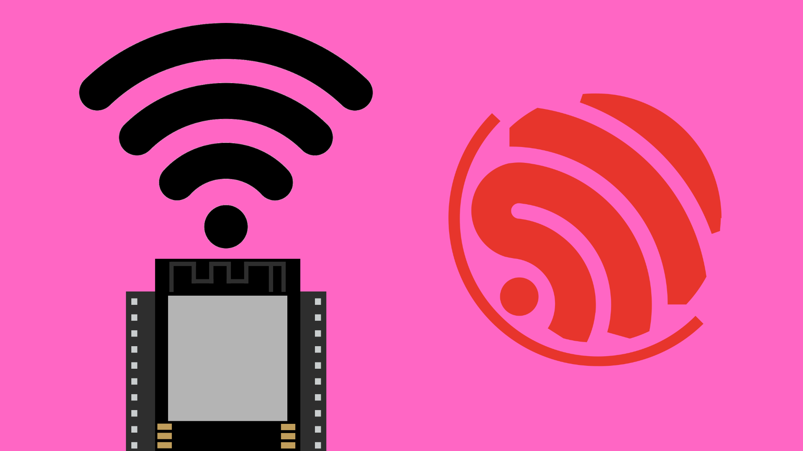

# ESP-NOW with ESP32




## Contents

- [Introduction](#introduction)
- [MAC Addresses](#mac-addresses)
- [Code](#code)


## Introduction

[ESP-NOW](https://www.espressif.com/en/solutions/low-power-solutions/esp-now) is a wireless communication protocol created by Espressif (the makers of ESP32), which enables quick, direct communication between ESP boards without the need to connect to a Wi-Fi network. The ESP32 can utilise ESP-NOW to send messages from:

- one ESP32 to another ESP32.
- one ESP32 to multiple ESP32s.
- multiple ESP32s to a single ESP32.
- a combination of the above.

This is a short range form of communication with a range of approximately 200m (650ft).


## MAC Addresses

ESP-NOW does not require a connection to a Wi-Fi network to send messages between devices. Instead, we only need to know the MAC address of the receiving device.

A MAC (Media Access Control) address is a unique identifier assigned to electronic devices to distinguish them on a network. In the context of ESP-NOW, we can think of it like a phone number; a unique code that we need in order to send data to a device.

We would recommend finding out what your devices' MAC addresses are (and writing it down) before starting with the ESP-NOW sketches. To find your device's MAC address, upload [this sketch](./GetMACAddress/GetMACAddress.ino) to your ESP32 and open the Serial Monitor. The MAC address should appear on the Serial Monitor and look something like this:

```
4C:75:25:9F:00:A8
```

This will need to be written like this in our code:

```cpp
uint8_t macAddress[] = { 0x4C, 0x75, 0x25, 0x9F, 0x00, 0xA8 };
```


## Code

Follow these links to find full example sketches for [sending ESP_NOW messages](./ESPNOW_Send/ESPNOW_Send.ino) and [receiving ESP-NOW messages](./ESPNOW_Receive/ESPNOW_Receive.ino).