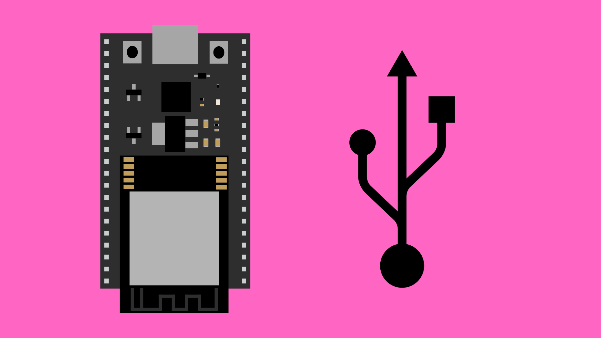

# USB Serial Messages




## Contents

- [Introduction](#introduction)
- [Code](#code)
    - [Set Baud Rate](#set-the-baud-rate)
    - [Sending](#sending-serial-messages)
    - [Receiving](#receiving-serial-messages)
    

## Introduction

USB Serial is the type of communication used by the Serial Monitor. It is essentially a simple way of communicating over a USB connection. The serial monitor is a valuable tool that allows us to communicate with our ESP32 boards from the Arduino IDE. So as long as the ESP32 board is connected to your computer via aUSB cable, you can send and receive USB Serial data to and from the board. 

This can be useful for a number of applications, including:

- Debugging messages.
- Live data monitoring.
- Data visualising.
- Input from the IDE.
- Sending serial data to other applications.

In this page, we will look at a couple of ways you might want to use the Serial Monitor in your own projects.


## Code

### Set the Baud Rate

To make use of serial communication in your code, you will first need to initialise the `Serial` class inside the `setup()` function.

This can be done using the method `Serial.begin()`. We will need to pass the **baud rate** as an input argument. The baud rate is the the speed of data transmission between the ESP32 and your computer. This is typically set to `115200` for ESP32 boards.

We will need to remember what value we have used for the baud rate for a later step.

``` cpp
void setup() {
    Serial.begin(115200);
}
```

### Sending Serial Messages

For a full example sketch, [click here](./USBSerial_Send/USBSerial_Send.ino).

After setting the baud rate in the `setup()` function, we can simply use the methods `Serial.print()` and `Serial.println()` to send serial messages.

- `Serial.print()` will simply send the data we put in the brackets.
- `Serial.println()` will send the data we specify in the brackets, but will also create a new line character at the end of the message. This means any messages sent afterwards will be printed on a new line.

``` cpp
Serial.print("Hello");      // print "Hello"
Serial.println(" World!");  // print " World!"  on same line

Serial.print("Ahoy!"); // will be printed on a new line
```


### Receiving Serial Messages

For a full example sketch, [click here](./USBSerial_Receive/USBSerial_Receive.ino).

Instead of using `Serial.print()` statements, we can use `Serial.available()` to  tell us if the Arduino has received any serial messages. We then use `Serial.readStringUntil('\n')` to parse the message and store it as a `String` variable. 

``` cpp
if (Serial.available() > 0) { 
    String incomingMsg = Serial.readStringUntil('\n');
}
```

We can now use this variable in our code however we like.