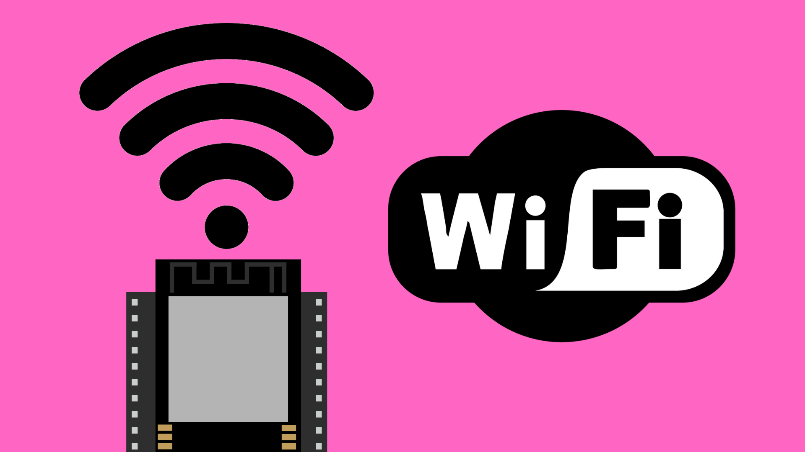

# Wi-Fi on the ESP32

## Contents

- [Introduction](#introduction)
- [Code](#code)
    - [Connect to Wi-Fi](#connecting-to-wi-fi)
    - [Create Access Point](#creating-a-wi-fi-access-point)

## Introduction

Most ESP32 boards will come with a built-in Wi-Fi antenna, allowing it to both connect to existing Wi-Fi networks and also create their own local wireless networks. This gives us the option to communicate with other devices, both over the internet and locally. 

An internet connection allows us to make use of [APIs](/contents/Communication/APIs/) and [cloud services](/contents/Cloud-Services). This can be really useful for pulling and pushing data to and from other parts of the internet.

Creating local networks is a bit like starting a Wi-Fi hotspot on your phone. It allows multiple other devices to connect to one shared network on the ESP32. This allows us to send data directly to devices on the same network using protocols like [ESP-NOW](/contents/Communication/ESP-NOW/) and [OSC](/contents/Communication/OSC/). This can be a very fast and convenient way of transferring data between multiple IoT devices.

## Code

You can use these links to find full example sketches for [connecting to Wi-Fi](./WiFi_Connect/WiFi_Connect.ino) and [starting a Wi-Fi access point](./WiFi_AccessPoint/WiFi_AccessPoint.ino) on the ESP32.