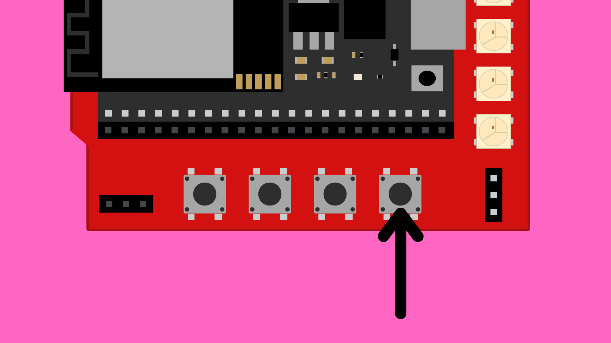

# ESP32 DevKitC Expansion Board: Buttons




## Contents

- [Introduction](#introduction)
- [Code](#code)

## Introduction

The ESP32 DevKitC Expansion board has four programmable buttons built in that we can use to provide quick, reliable user input without needing to wire up any additional circuitry. 

The buttons are connected to the GPIO pins on the ESP32 as follows:

| Button | GPIO |
| ------ | ---- |
| 0      | 14   |
| 1      | 27   |
| 2      | 26   |
| 3      | 25   |


## Code

Full example sketch can be found [here](./ESP32_ExpansionBoard_Buttons/ESP32_ExpansionBoard_Buttons.ino).

In the `setup()` function we first need to use the `pinMode()` to initialise the corresponding GPIO pins as `INPUT_PULLUP`.

``` cpp
#define BUTTON_0 14
#define BUTTON_1 27
#define BUTTON_2 26
#define BUTTON_3 25

void setup() {
    pinMode(BUTTON_0, INPUT_PULLUP);
    pinMode(BUTTON_1, INPUT_PULLUP);
    pinMode(BUTTON_2, INPUT_PULLUP);
    pinMode(BUTTON_3, INPUT_PULLUP);
}
```

We can then use the `digitalRead()` value to read the state of each button. This will return a `0` if the button is pressed and `1` if not.

``` cpp
digitalRead(BUTTON_0);
```