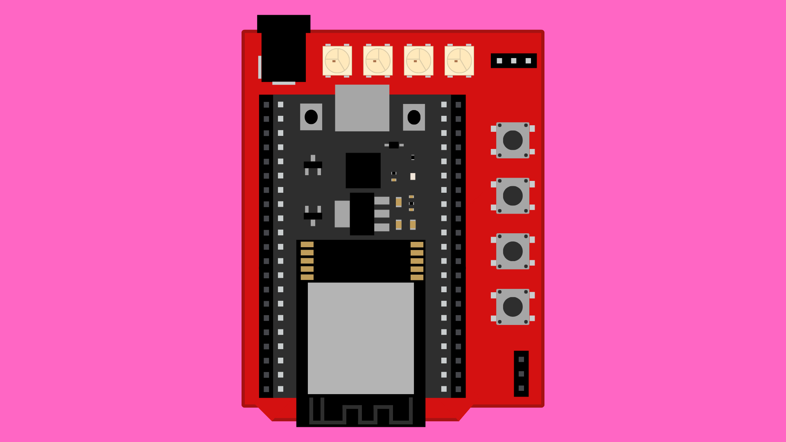

# ESP32 DevKitC Expansion Board: Overview

## Contents

- [Introduction](#introduction)
- [Components](#components)
- [Pinout](#pinout)

## Introduction

Usually when prototyping with an ESP32 board, we need to plug it into a breadboard and connect any external components using jumper wires. This can be a bit fiddly, time-consuming, and potentially require a mess of wires. There is also the drawback of ESP32 boards generally being slightly to large to fit on a breadboard without losing access to an entire row of pins.

The ESP32 DevKitC Expansion Board lets us plug in the ESP32 DevKitC and instantly access buttons, LEDs, and dedicated sockets for a potentiometer, servo motor, and Grove connector. It also breaks out all pins to female headers, making it easy to connect jumper wires for prototyping.

This expansion board has been designed with the form factor of the Arduino uno to make the transition from Arduino projects to ESP32 as straight-forward as possible. This includes a DC barrel jack connector where we can power our projects using a 5V power supply.

This particular expansion board has been designed at ECA to make it easier to explore the capabilities of the ESP32.

## Components

- 1x ESP32 DevKitC socket
- Female breakout pin headers
- 4x [Buttons](/contents/Expansion-Board/Buttons/)
- 1x [Potentiometer socket](/contents/Expansion-Board/Potentiometer/)
- 4x [Addressable LEDs](/contents/Expansion-Board/LEDs/)
- 1x [Servo motor socket](/contents/Expansion-Board/Servo/)
- 1x Grove connector
- 1x DC barrel jack connector for power supply*

\* *Board must be powered by using 5V power supply only. Anything more may damage the ESP32 and LEDs.*

## Pinout

### Expansion Board Connections

| Button | Pin |
| - | - |
| Button 0 | 14 |
| Button 1 | 27 |
| Button 2 | 26 |
| Button 2 | 25 |

|||
| - | - |
| **Potentiometer** | 32 |

|||
| - | - |
| **Servo** | 12 |

|||
| - | - |
| **LED** | 13 |

|||
| - | - |
| **Grove connector** | 39 |

### ESP32 DevKitC Pins

|||
| - | - |
| **PWM** | 0-19, 21-23, 25-27, 32 |
| **Analog Input** | 0, 2, 4, 12-15, 25-27, 32 |
| **Input Only** | 34-36, 39 |
| **I2C** | 22* (SCL), 21 (SDA) |
| **SPI** | 5 (SS), 23 (MOSI), 19 (MISO), 18 (SCK) |
| **UART** | 1 (TX0), 3 (RX0), 10 (TX1), 9 (RX1), 17 (TX2), 16 (RX2) |

\* *This is incorrectly marked as pin 39 on v0.3.*

