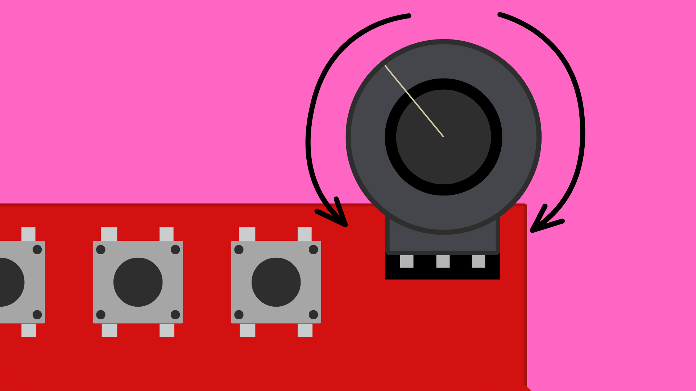

# ESP32 DevKitC Expansion Board: Potentiometer




## Contents

- [Introduction](#introduction)
- [Code](#code)

## Introduction

The ESP32 DevKitC Expansion board has a socket for connecting a potentiometer to the ESP32. This can be found on the bottom right of the board, below the buttons.

Plugging in a potentiometer here will connect it to **pin 32** on the ESP32 and we can use the `analogRead()` function to read its value.


## Code

Example sketch [here](./ESP32_ExpansionBoard_Potentiometer/ESP32_ExpansionBoard_Potentiometer.ino).

To read the potentiometer value we simple need to use the `analogRead()` function.

``` cpp
// Read analog value at pin 32
analogRead(32);
```

One key thing to note is that ESP32 boards use a 12bit analog-to-digital converter (ADC) rather than the 10bit ADC that you can find on most Arduino boards. This means that the `analogRead()` function will return a value between **0-4095** instead of **0-1023**. 

You may need to take this into account if you are converting Arduino code for ESP32.