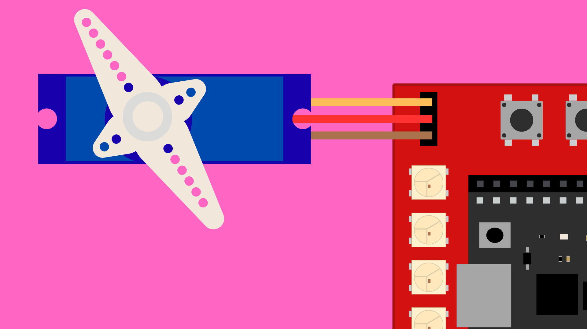

# ESP32 DevKitC Expansion Board: Potentiometer




## Contents

- [Introduction](#introduction)
- [Code](#code)

## Introduction

The ESP32 DevKitC Expansion board has a socket for connecting a servo motor. We can use servos to add motion to our projects by moving components such as arms, levers, or sensors in a controlled manner.

Plugging in a servo will connect it to **pin 12** on the ESP32. Make sure you plug the servo in the right way around:

| Servo             | Board |
| ----------------- | ----- |
| Brown/Black wire  | -     |
| Red wire          | +     |
| Orange/White wire | S     |

## Code

Example sketches:
- [Servo sweep](./ESP32_ExpansionBoard_ServoSweep/ESP32_ExpansionBoard_ServoSweep.ino)
- [Potentiometer control](./ESP32_ExpansionBoard_ServoPot/ESP32_ExpansionBoard_ServoPot.ino)

To control the servo in our sketches, we can use the `ESP32Servo.h` library. This library is installed by default with the ESP32 board manager so **we do not need to install this library ourselves**.

Including the `ESP32Servo.h` library in our sketches gives us access to the `Servo` class which we can use to set the position of the servo. 

``` cpp
#include <ESP32Servo.h>
Servo servo;
```

In the `setup()` function, we will need to attach the servo pin to this `Servo` class object.

``` cpp
// Attach pin 12 to servo object
servo.attach(12);
```

We can then set the position of the servo between 0-180 degrees using the `write()` method. 

``` cpp
// Set servo to 90 degrees
servo.write(90);
```