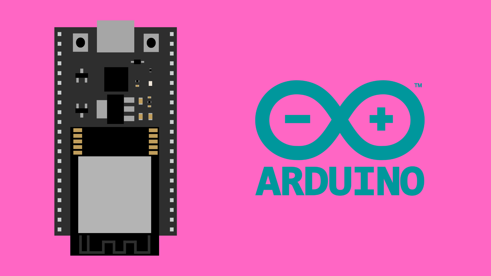
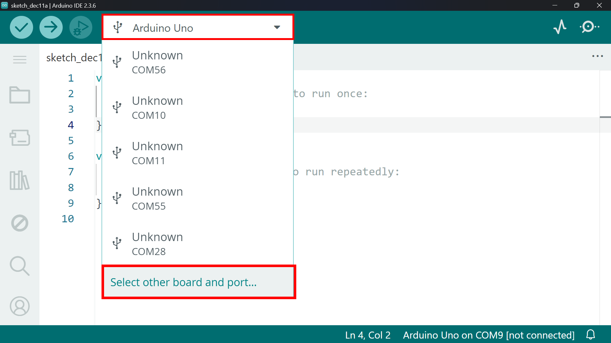
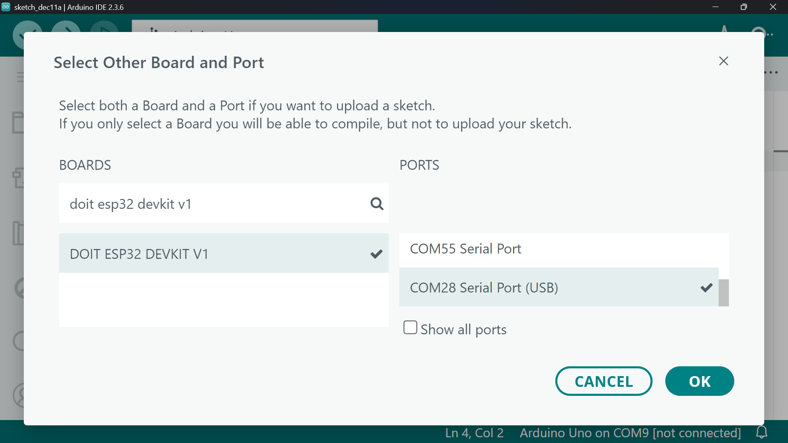
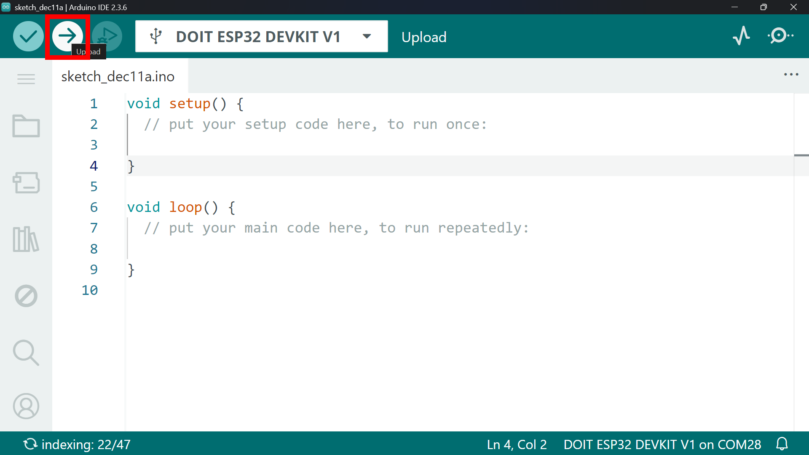

# Programming the ESP32 DevKitC from the Arduino IDE




## Contents

- [The Arduino IDE](#the-arduino-ide)
- [Installing the Arduino IDE](#installing-the-arduino-ide)
  - [System Requirements & Dependencies](#system-requirements--dependencies)
  - [Download](#download)
- [Boards Manager](#boards-manager)
  - [Install](#install)
  - [Select Board](#select-board)
- [Uploading Code](#uploading-code)


## The Arduino IDE

The Arduino IDE is a simple, beginner-friendly programming environment. If you’ve used Arduino boards before you will be familiar with the workflow, and even if you haven’t, Arduino IDE makes setup and navigation very straightforward.

By default the Arduino IDE is only setup to program Arduino boards, so we will need to install a separate board manager for to start programming ESP32 boards.


## Installing the Arduino IDE

### System Requirements & Dependencies

To install and run Arduino IDE 2.x, your computer should meet these requirements:

* **Windows 10 or newer**
* **macOS 10.15 “Catalina” or newer**

At least **2 GB of RAM** is recommended, and the IDE (plus boards and libraries) will use around **400 MB** of storage.

Some ESP32 board tools require **Python**, but it is almost always installed automatically by the ESP32 board manager. If you need to install Python manually, you can do so from [python.org](https://www.python.org/downloads/).


### Download

You can find the download files and instructions from the Arduino website ([click here](https://www.arduino.cc/en/software/)).

The download is free. You may be prompted to donate or subscribe to the Arduino newsletter — both are optional.

**Note for Mac users:** You may be prompted to install XCode by the IDE. You **do not** need to install this in order to use the IDE and most likely should not. If prompted, just press *cancel*.


## Boards Manager

### Install 

The ESP32 board manager is not included in the IDE by default, so we need to install the **ESP32 Board Manager** from Espressif.

1. Open the **Preferences** window:
   - **Windows:** *File → Preferences*
   - **Mac:** *Arduino → Preferences*
2. In the field **Additional Boards Manager URLs**, paste the following link:

```
https://espressif.github.io/arduino-esp32/package_esp32_index.json
```
3. Click **OK**.

You can then navigate to *Tools > Board > Boards manager*. Search for **“ESP32”** and install. This may take a few minutes.

### Select Board

Before uploading code, we must select the correct ESP32 board and port. For the ESP32 DevKitC (included in the Bookit Kit), we will use the **"DOIT ESP32 DEVKIT V1"** board:

1. At the top of the IDE, click the board selector dropdown.



2. Choose **Select other board and port…**
3. Search for **"DOIT ESP32 DEVKIT V1"**.
4. Pick the USB port marked with *(USB)*.



Once both board and port are selected, click **OK**.


## Uploading Code

You can now upload code using the **Upload** button (right-facing arrow).



The IDE will compile and upload the program, then display a message confirming success.