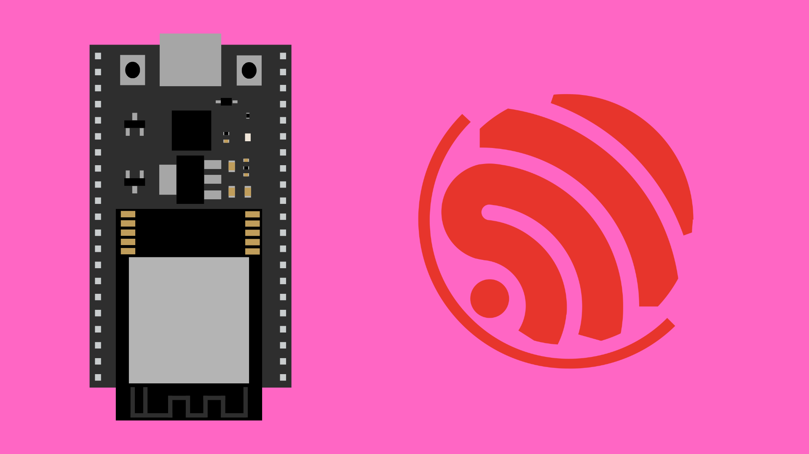

# ESP32 Overview

## Contents

- [What is the ESP32?](#what-is-the-esp32)
- [ESP32 Board Variants](#board-variants)
- [Why Use the ESP32?](#why-use-the-esp32)
- [ESP32 Features](#esp32-features)
- [Programming the ESP32](#programming-the-esp32)

## What is the ESP32?

The **ESP32** is a low-cost, low-power microcontroller developed by [Espressif Systems](https://www.espressif.com), widely used in electronics projects, consumer products, and IoT applications. It combines fast processing, built-in wireless communication, and flexible input/output capabilities, making it far more powerful than classic Arduino boards such as the Uno or Nano.

ESP32 boards are commonly used for:

- Smart home devices
- Wireless sensors
- Robotics
- LED controllers
- Wearable devices
- Wi-Fi/Bluetooth automation

Because of its performance and versatility, the ESP32 has become one of the most popular microcontroller platforms in electronics and IoT prototyping.

## Board Variants 

ESP32 boards come in many different variants in different shapes and sizes with different features. For these tutorials we will be focusing on the ESP32 DevKitC as these are the boards in the ESP32 kit available on [Bookit](https://bookit.eca.ed.ac.uk/av/).

## Why Use the ESP32?

The ESP32 offers several advantages over more traditional microcontrollers, making it a popular choice for modern electronics and IoT projects. One of its biggest strengths is its built-in Wi-Fi and Bluetooth, which allows devices to connect wirelessly without any additional modules. It also features a fast dual-core processor running at up to 240 MHz, giving it significantly more processing power than most Arduino boards.

Beyond speed, the ESP32 provides a wide range of input and output options, including numerous digital pins, analog inputs, PWM outputs, touch sensors, and multiple communication interfaces. Despite these advanced capabilities, ESP32 boards remain very affordable, often costing less than simpler microcontrollers.

The ESP32 also benefits from a large and active community, with support across platforms such as the Arduino IDE, PlatformIO, MicroPython, and Espressif’s own IDF.

## ESP32 Features

While different ESP32 boards vary slightly, the core ESP32 chip typically includes:

- Dual-core processor up to 240 MHz
- Wi-Fi
- Bluetooth Classic + BLE
- 520 KB RAM
- 4 MB (or more) Flash Memory
- Up to 34 GPIO pins
- Analog-to-Digital Converters (ADCs)
- Digital-to-Analog Converters (DACs)
- PWM outputs
- SPI, I2C, UART communication interfaces
- Touch sensor inputs
- Hall effect sensor
- Ultra-low-power co-processor for sleep modes

Not every board exposes all these features, but most ESP32 development boards (including the DevKitC) offer the majority of them.

## Programming the ESP32

The ESP32 can be programmed in several environments, including:

- **Arduino IDE** - (simplest and beginner-friendly)
- **PlatformIO** - (powerful for more advanced users)
- **MicroPython** - (Python on microcontrollers)
- **Espressif IDF** - (the official professional SDK)

For these tutorials, we will use the [Arduino IDE](/contents/Getting-Started/Arduino-IDE/), as it provides a straightforward way to upload code and experiment with ESP32 features.